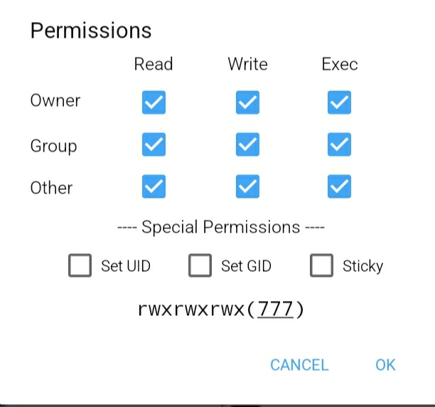

```markdown

█▀▀ █▀█ █▀▄ █▀▀ ▀▄▀
█▄▄ █▄█ █▄▀ ██▄ █░█

Advanced DEX Dumper Tool

## Description
CODEX is a powerful memory-based DEX file extraction tool designed for Android applications. It scans process memory to locate and dump DEX files from running applications.

## Core Features
- DEX file memory scanning
- Dump dex in protection app
- Support All arm

## Update V2
- add Dobby implement hook
- Memory hook
- optimize dex
- fix duplicate
- Multi dex fixed
- Atomic operations
- Improved PID detection
- improved Thread
- Fixed constructor initialization

## Details
- Language: C++
- Target: Android OS
- Root Required: Yes
- File Format: DEX

## Installation & Usage

1. Push file to device:
```bash
adb push codex /data/local/tmp/
```

2. Set permissions:
```bash
adb shell
su
chmod 777 /data/local/tmp/file in here 
```
3. Run:
```bash
cd /data/local/tmp
./CODEX <package_name>
```

Example:
```bash
./CODEX com.example.app
```

Note: Root access required to run this tool.

Output files will be saved in:
```
/data/local/tmp/dex_dump_[package_name]/
```
## Alternative Run

Copy file to /data/local/tmp/

Give permission manual



open your terminal 

```bash
su
```
```bash
cd /data/local/tmp/CODEX
```
```bash
./CODEX com.example.app
```
Telegram Information 
---
@Qwanwin | @codex4444
